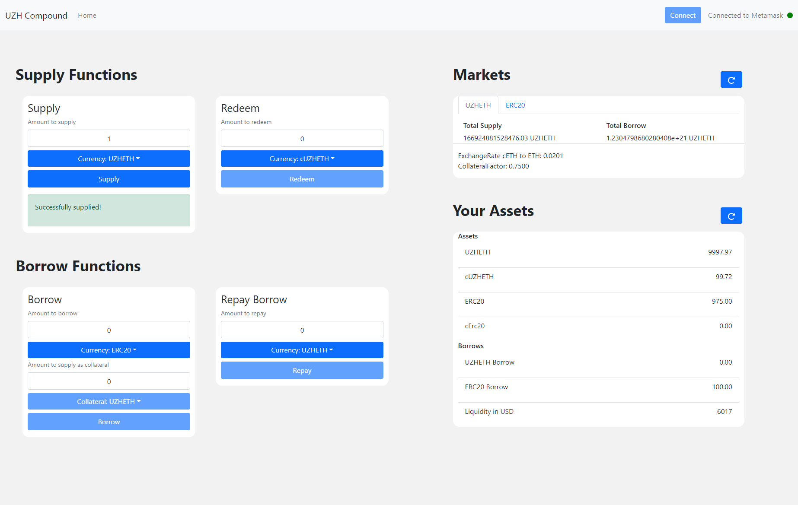

# Deploying and Interacting with Compound
This project was created in the context of the seminar on 'Blockchain Programming' HS21 at the University of Zurich, offered by the [UZH Blockchain Center](https://www.blockchain.uzh.ch/).  Within this seminar, our group investigated the deployment of [Compound](https://compound.finance/) - a financial protocol for autonomous interest rates - and it's application on mortgages. This repository only represents the technical setup.

The repository  is composed of two parts. The first component `compound-protocol` includes the required files and scripts to fork the Mainnet and deploy intermediary layers abstracting the compound protocol. The second component, the `compound-dashboard`, is a simple front-end, *i.e*., a dashboard that serves as a web interface to the compound protocol.



## Setting Up Compound
The first component of this repository serves as an easy way to run a local Ethereum blockchain. To do so, the [Mainnet](https://ethereum.org/en/developers/docs/networks/)  is forked and seeded with assets. Thereby, one can interactively test how the Compound protocol works. This process was adapted from the Compound developer [guide](https://compound.finance/docs). For more details, look into their tutorials. Note that the scripts used in this section are adopted from the Compound contributors ([source](https://github.com/compound-developers/)).

First, clone this repository and make sure you have [node](https://docs.npmjs.com/downloading-and-installing-node-js-and-npm) and [hardhat](https://hardhat.org/getting-started/) installed. Then navigate to the `compound-protocol` component and install the required dependencies.

```console
cd compound-protocol
npm install
```
Next, [Infura](https://blog.infura.io/getting-started-with-infura-28e41844cc89/) is used for Ethereum network access. Create an account and extract the Project ID. After that, execute the following commands to run the Mainnet fork on localhost.

```console
export PROJECT_ID="<YOUR-PROJECT-ID>" 
export MAINNET_PROVIDER_URL="https://mainnet.infura.io/v3/$PROJECT_ID" 
export DEV_ETH_MNEMONIC="clutch captain shoe salt awake harvest setup primary inmate ugly among become"

node ./scripts/run-localhost-fork.js
```

For reasons of simplicity and safety, there are abstraction contracts available for deployment. This makes of the core features of compound easier:

```console
cd compound-protocol

export PROJECT_ID="<YOUR-PROJECT-ID>" 
export MAINNET_PROVIDER_URL="https://mainnet.infura.io/v3/$PROJECT_ID" 
export DEV_ETH_MNEMONIC="clutch captain shoe salt awake harvest setup primary inmate ugly among become"

npx hardhat compile 
npx hardhat run ./scripts/deploy.js --network localhost
```
The output should look similar to the following:

```console
Deploying contracts with the account: 0xa0df350d2637096571F7A701CBc1C5fdE30dF76A
Account balance: 10000000000000000000000
Contract CompoundBorrow address: 0xEcA3eDfD09435C2C7D2583124ca9a44f82aF1e8b
Contract CompoundSupply address: 0xE8a6f04DEF6d9fa9F02982b8E1d8Eea835fB7668
```

To test your local instance of the Compound protocol, one can run the `dashboard-scripts` to investigate the core features of Compound. To do so, run the following commands in a new terminal after starting your node as described above:

```console
node dashboard-scripts/borrow-eth-via-solidity.js
```

## The Compound Dashboard
To offer an accessible development interface, we have created a simple React dashboard that allows testing Compound's core functionalities of supplying, redeeming, borrowing and repaying assets. The source code of the dashboard is available within the second component `compound-dashboard` of this repository. Note that the dashboard does not make use of the intermediary abstraction contracts, optionally deployed in this [section](#setting-up-compound).

To run the dashboard, first make sure to have [node](https://docs.npmjs.com/downloading-and-installing-node-js-and-npm) with [npm](https://www.npmjs.com/) installed. The react-app makes use of Metamask to connect to the Ethereum network, therefore it is required to be installed as a browser extension, see [here](https://metamask.io/).  The follow the steps below, then visit 

```console
cd compound-dashboard
npm install
npm start
```

In case you added or modified any contracts in `compound-protocol/contracts/`, deployed them and want to tether your dashboard to it, you may want to adjust the abi definitions at `/compound-dashboard/src/scripts/contracts/contracts.json` and the contract addresses at `/compound-dashboard/src/const/addresses.js`.
